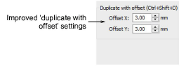

# Improved options for ‘duplicate with offset’

The Options > Edit tab includes improved ‘duplicate with offset’ options, more consistent with how the feature works. Duplicate position settings are ‘nominal’ in that they apply to normal Ctrl+Shift+D operations. However, clone by right-click and drag operations will override these settings temporarily. [See also Paste & duplicate options.](../../Setup/settings/Paste_duplicate_options)

