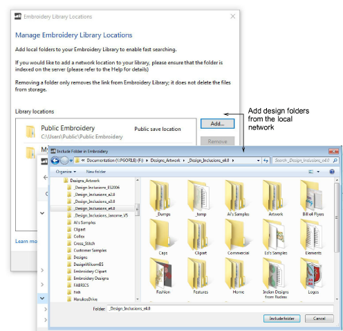

# Manage folders in the library from a single control

|  | Use Manage Designs > Manage Embroidery Library Locations to add or remove existing folders from the Embroidery Library, enabling fast searching and filtering. |
| ------------------------------------------------------------------------------------ | -------------------------------------------------------------------------------------------------------------------------------------------------------------- |

The mechanism for adding and removing folders from the Design Library has been improved with the addition of the Manage Embroidery Library Locations function. This replaces the obsolete Add Folder to Library and Remove Folder from Library functions. [See Locating designs in the library for details.](../../Management/manage_designs/Locating_designs_in_the_library)

::: info Note
For businesses with multiple computers reading and writing EMB or machine format designs, there is usually a need to store designs in shared network folders. You may want to set up a company server as a central repository for all design files. Connect any folders on the server to each client PC via Design Library. Design Library relies on Windows indexing to ensure fast searching. [See also Fast searching on shared network drives.](../../Management/manage_designs/Fast_searching_on_shared_network_drives)
:::
