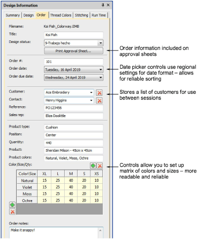

# New Order tab Color/Size/Quantity table

The Order tab in the Design Properties docker includes a number of improvements. Order information is saved directly with the design file. This allows embroidery orders to be managed via the designs they use without the need for a commercial database. The information is included on approval sheets. [See also Managing quotes & orders.](../../Management/manage_designs/Managing_quotes_orders)

Note the following:

- All fields in the Design Properties docker can now be read and written in Design Library.
- The Color/Size/Qty table is included in the approval and production worksheets. Click buttons to add rows and columns. Double-click to edit labels.
- Numeric displays use Windows locale settings.
- Order date fields use the ‘Long Date’ format as set in the Windows ‘Region’ settings. These can be changed via the Windows Control Panel > Region settings.
- Date fields use locale settings.
