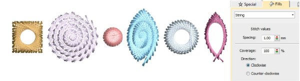

# New String stitch

|            | Use Fill Stitch Types > String to create string craftstitch fills. Apply to closed shapes.                                 |
| ------------------------------------------ | -------------------------------------------------------------------------------------------------------------------------- |
|  | Use Fill Stitch Types > String to create string craftstitch outlines for delicate borders. Apply to open or closed shapes. |

New String stitch type is ideally suited to creating craftstitch fills as well as delicate borders. It can, for instance, be used as a border for fixing ornamental mirrors and sequins. Apply to open or closed shapes. [See also String stitching.](../../Decorative/specialty/String_stitching)

::: info Note
String stitch is included as a separate Element within ES Designing and ES Digitizing products.
:::
