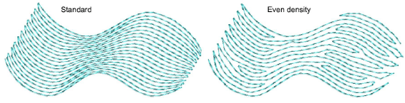

# New even density contour fill

|  | Use Outline Stitch Types > Contour to create outlines which follow object contours, creating a curved, light-and-shade effect. Right-click for settings. |
| ------------------------------------------------ | -------------------------------------------------------------------------------------------------------------------------------------------------------- |
|        | Use Fill Stitch Types > Contour to create fills which follow object contours, creating a curved, light-and-shade effect. Right-click for settings.       |

Contour is a curved fill stitch type which can be applied to Column A/B or Circle/Ring objects. It can also be used for outline stitching. Stitches follow the contours of a shape, creating a contoured, light and shade effect. Contour now includes an Even Density Contour fill method which maintains even density across shapes which vary in width. Contour stitching follows the shape with uniform stitch density. [See also Contoured fills.](../../Decorative/curves/Contoured_fills)

