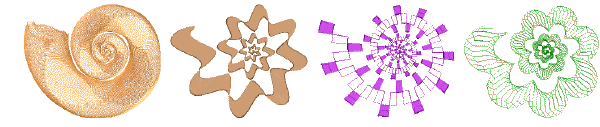
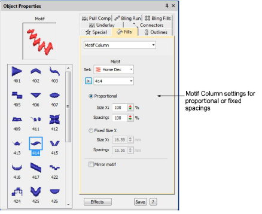

# New motif column

|  | Use Fill Stitch Types > Motif Column to place motifs along the center line of a column shape and resize to fit the shape. Right-clicking for settings. |
| -------------------------------------------- | ------------------------------------------------------------------------------------------------------------------------------------------------------ |

The Motif Column feature is part of the new Advanced Motifs Element. Motifs dynamically resize to fit varying widths. Similar in concept to flexi-split with turning satin, you digitize a tapering shape using, for example, Column A. Apply Motif Column and select a motif. Motifs are automatically ‘enveloped’ to fit to the shape.

Right-clicking the Motif Column tool opens the Object Properties docker with its dedicated Motif Column fill stitch settings. [See also Create graded motif columns.](../../Decorative/motifs/Create_graded_motif_columns)

