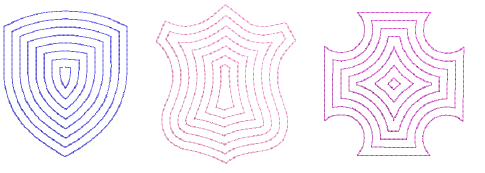

# Offset fill

|  | Use Fills Stitch Types > Offset Fill to create offset fill stitching in any closed shape. |
| -------------------------------- | ----------------------------------------------------------------------------------------- |

New Offset Fill is similar to Contour in producing a curved fill stitch type which follows the contours of the shape. However, it can be applied to complex fill objects as well as turning stitch objects. Stitch angles, however, have no effect on the fill pattern. Like Contour, it is best used for open fills with low stitch counts. [See also Offset fills.](../../Decorative/curves/Offset_fills)

