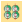
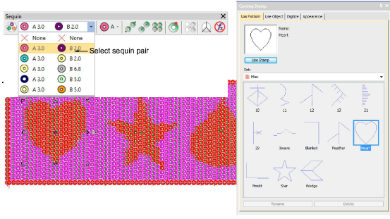

# Pattern stamp re-coloring of twin-sequin fills

|      | Use Sequin > Sequin Fill to digitize and fill large, irregular shapes with sequins.                          |
| -------------------------------------------- | ------------------------------------------------------------------------------------------------------------ |
|  | Use Docker > Carving Stamp to define a pattern of needle penetrations using a ‘carving stamp’ as a template. |

Sequin Fill can now be used in combination with Carving Stamp to digitize sequin fills with predefined twin sequin assignments. The stamp pattern takes the color of the other sequin in the currently selected pair. [See also Flip sequins.](../../Applied/sequin_advanced/Flip_sequins)

