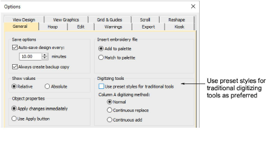

# Preset styles for traditional tools

|  | Use Standard > Options to access application options for digitizing tools. |
| ---------------------------------- | -------------------------------------------------------------------------- |

Use preset styles for traditional digitizing tools as preferred by selecting the option in the Options > General tab. [See also Digitizing presets.](../../Setup/settings/Digitizing_presets)

Select the preset styles option to have the traditional digitizing tools behave the same as they did in e3 (default). Preset styles use a set of predefined stitch types and underlay parameters for each of the traditional digitizing tools. These styles can be changed and saved to the normal template as preferred.
