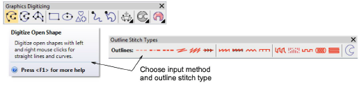
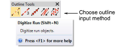

# Reinstated outline tools

The traditional outline input methods have been reinstated in the software. You now have a choice of graphical or traditional input methods for outline stitching. [See also Digitizing outlines & details.](../../Digitizing/input/Digitizing_outlines_details)

- Select a suitable input tool together with an outline stitch type.

- Alternatively, choose a traditional outline input method from the Outline Tools.

