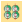
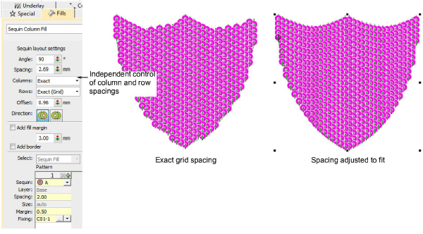

# Smooth edges in sequin fills

|  | Use Sequin > Sequin Fill to digitize and fill large, irregular shapes with sequins. |
| -------------------------------------------------- | ----------------------------------------------------------------------------------- |

Sequin Fill now provides independent control of column and row spacings. Set the nominal spacing in the Spacing field. Choose whether you want the fill to fit the grid exactly or to be adjusted line-by-line to fit the shape. You have the option of expanding or contracting spacings in either or both rows and columns. Each line is adjusted separately. The aim is to make sequins follow to the edge of the shape for all lines in the fill. This is less important if you add a border to the fill. [See also Adjust sequin layouts.](../../Applied/sequin_advanced/Adjust_sequin_layouts)

