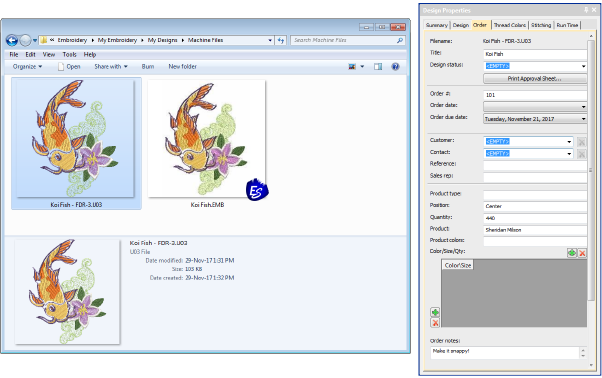

# Support for Barudan FDR-3 design format

ES e4.1 can now write Barudan FDR-3 format machine files. FDR-3 file thumbnails display in the correct thread colors in Design Library and Design Explorer, as well as on the machine. Summary production details are also included with the file, reducing the possibility of production errors.

