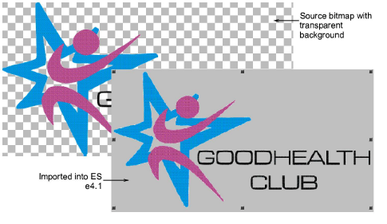

# Support for image transparencies

Support is now provided for transparent backgrounds in 24 bit and 32 bit images. [See also Preparing artwork for digitizing.](../../Automatic/bitmaps/Preparing_artwork_for_digitizing)

If an image contains a transparent background:

- The background is automatically excluded from auto-digitizing.
- The image is automatically cropped to its visible extents.

These improvements apply to both Smart Design and Color PhotoStitch.

Warning: Avoid using images that contain semi-transparent or transparent pixels within image color areas as these cause poor results when reducing the color count. The resulting pixels may end up as holes inside the image or significantly reduce color areas to the point where they are unnecessarily removed from the embroidery results.
