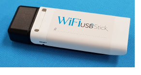
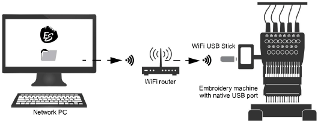

# WiFi USB machine networking

A new EmbroideryConnect element is available for customers to send machine files to any embroidery machine with a ‘native’ USB port (not USB converter). When activated in the software, you can send machine files wirelessly via a standard WiFi network to a compatible WiFi USB Stick plugged into the machine. Tajima, Barudan, and most modern commercial embroidery machines can read files from a standard USB memory stick. There is no need for serial ports, different interface methods, or wiring for different machines.

The simplest type of configuration is shown below.

You are not limited to a single relationship between PC and embroidery machine. You can send designs to many machines from the one PC. Or you can send designs from many PCs to the same machine via its shared folder. [See Machine Networking for details.](../../Production/network/Machine_Networking)
