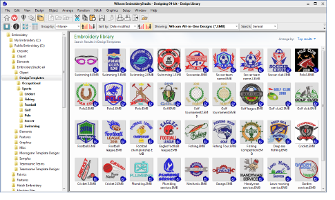
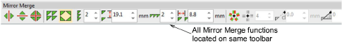
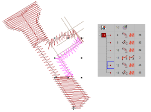
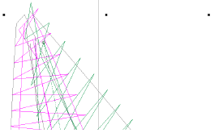
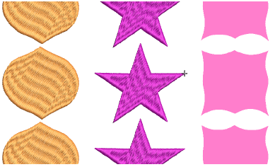

# Digitizing improvements

The ES e4.2 software update includes the following digitizing and design creation improvements…

## New design templates

EmbroideryStudio e4 includes a collection of over 40 new editable design templates in a range of categories, including sports and business logos such as cafés, construction, and other services. See the new Design Templates folder.

## Improved Mirror Merge toolbar

Previously, Mirror Merge settings were separated from the main toolbar as two separate toolbars. This has now been reverted back to a single Mirror Merge tools and settings toolbar. [See also Mirroring & reflecting selections.](../../Modifying/productivity/Mirroring_reflecting_selections)

## Unwanted travel runs in Column C objects

Problems have been reported with unnecessary travel runs in certain Column C objects. To remove them, stitches currently need to be regenerated. This problem has been resolved in ES e4.2.

## Nudging at high zoom factors

Problems have been reported when nudging objects at high zoom factors. If you zoom in too close, the object doesn’t respond to nudging with arrow keys. This problem has been resolved in ES e4.2.

## Vector objects used in repeats

A problem has been reported when using vector objects with Show Repeats. At high zoom factors, vectors fail to appear. This problem has been resolved in ES e4.2.

