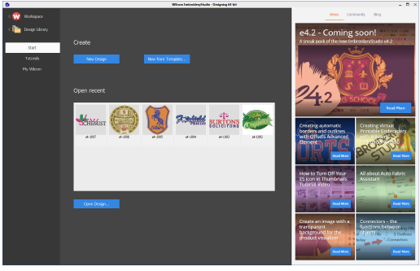
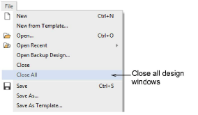
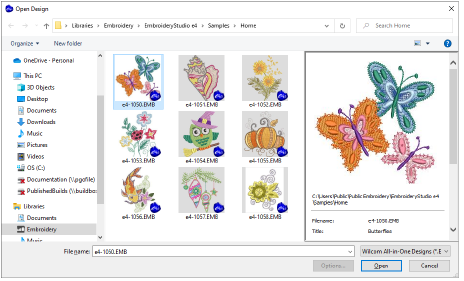
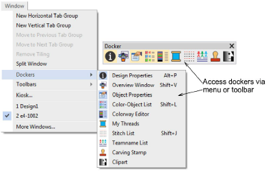
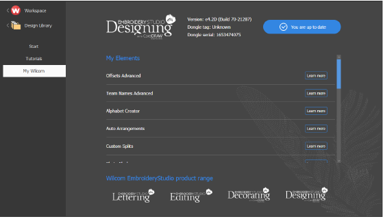

# General improvements

The ES e4.2 software update includes the following general improvements…

## New 64-bit operating system support

EmbroideryStudio e4 now supports 64-bit operating system. You’ll notice a big improvement in speed and performance.

Note: Note that 32 bit systems are no longer supported by ES e4.2\. It is installed in the 64 bit C:\\Program Files\\Wilcom\\EmbroideryStudio_e4.5 folder. You can, however, still run previous versions of ES e4 on the same computer. See also System requirements.

Note: The VIP file format is not currently supported by the new 64-bit operating system.

## New Wilcom Home screen

|  | Click Mode > Home to return to the Home screen to get started with a new design, or access tutorials and other product information. |
| ---------------------------- | ----------------------------------------------------------------------------------------------------------------------------------- |

A new Home screen loads when EmbroideryStudio starts, offering you quick access to recent new designs, as well as value-add content, including tutorial videos and the latest Community Forum and Product Blog posts. You can also browse ‘My Wilcom’ which provides details of your Wilcom license, including product level, version, as well as compatible or enabled Elements. [See also Operating modes.](../../Basics/basics/Operating_modes)

## Wilcom Workspace

|  | Use Mode > Switch to Wilcom Workspace to digitize and edit embroidery designs. Display embroidery as well as artwork. View designs realistically in 3D simulation. |
| ------------------------------------------------ | ------------------------------------------------------------------------------------------------------------------------------------------------------------------ |

Depending on your level of product, there are two fundamental design modes in EmbroideryStudio:

[CorelDRAW Graphics: This mode allows you to create or edit graphic designs using the CorelDRAW® Graphics Suite toolset.](../../glossary/glossary) [Wilcom Workspace: This mode allows you to create and edit embroidery designs using an embroidery ](../../glossary/glossary) [digitizing toolset.](../../glossary/glossary)

Note that the Wilcom Workspace was previously known as Wilcom Decoration. [See also Operating modes.](../../Basics/basics/Operating_modes)

## New Close All design windows

It is now possible to close all design windows at once with the File > Close All command. [See also Save & close designs.](../../Basics/basics/Save_close_designs)

## Improved design thumbnail display

Design thumbnails now reflect display settings at the time of saving. When a design is saved, the design thumbnail is generated using all visible objects as well as the current design background. If you have bitmap or vector display turned on, these too appear in the thumbnail.

Note: Users with older designs have been affected by the load time involved in previewing them in Design Library or Windows Explorer. Thumbnails in some older designs can take many seconds to generate. This problem has been resolved in ES e4.2.

## Access to dockers

For clarity and ease-of-use, the Window > Dockers menu has been resequenced to the same order as the Docker toolbar.

Note: The Colorway Editor and Threads buttons are mutually exclusive. One toggles the other.

## Network dongle drivers

The latest HASP drivers for the Network Dongle have been packaged with ES e4.2\. They will be updated automatically when you install ES e4.2 on the PC where the network dongle is connected. Alternatively, you can install them manually from the Support folder of the e4.2 Installation USB using the command line: haspdinst.exe /i /kp.

## Software updates

|  | Click Mode > Home to return to the Home screen to get started with a new design, or access tutorials and other product information. |
| -------------------------------------- | ----------------------------------------------------------------------------------------------------------------------------------- |

With EmbroideryStudio e4, maintenance updates will be available periodically. You have the option of installing immediately or postponing till later. Go the My Wilcom screen of the Home page to check your current status.

