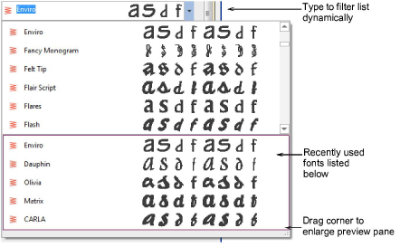
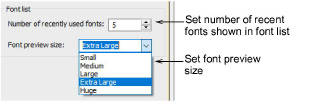
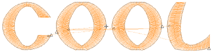

# Lettering improvements

The ES e4.2 software update includes the following lettering improvements…

## Improved font preview

The font preview of lettering objects is now a solid color making it easier to see your custom lettering in your selected font. Preview size can be adjusted. The preview pane can be enlarged. Fonts can be more easily found. [See also Select embroidery fonts.](../../Lettering/lettering_create/Select_embroidery_fonts)

## Improved font selection

Font selection has been improved in various ways:

- The font list now provides a preview of recently used fonts.
- If you know what you are looking for, simply start typing the font name and the list will update dynamically.
- When you open the font list, it remembers the previously selected font, allowing you to continue searching from this point.

## New font list settings

You can set the size of your font preview via the Options > General tab. You can also adjust the number of recently used fonts. [See also General options.](../../Setup/settings/General_options)

## Stitching for accented characters

Problems have been reported with certain accented characters such as the à (A with tilde). Stitching was being unnecessarily duplicated. This problem has been resolved in ES e4.2.

## Stitching for Glory Applique

Problems have been reported with Glory Applique lettering. Stitch spacing is too dense when created between the recommended minimum (30.00 mm) and maximum (100.00 mm) size. Furthermore, when text is entered directly into the design window, lettering is created with satin underlay of the same density as the cover stitch. This problem has been resolved in ES e4.2.

## Unwanted ‘zingers’ in text

Problems have been reported when creating some text as shown. Unwanted ‘zingers’ are generated between certain letters. This problem has been resolved in ES e4.2.

