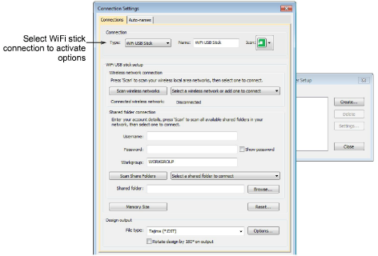
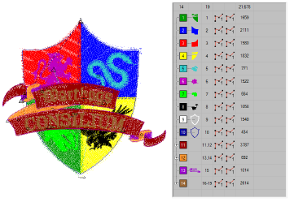
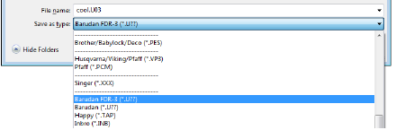

# Output improvements

The ES e4.2 software update includes the following machine connection improvements…

## Improved EmbroideryConnect setup

The setup process for EmbroideryConnect has been simplified to improve the setup process. The dialogs have been rearranged to reduce the number of manual steps necessary. [See Machine Networking for details.](../../Production/network/Machine_Networking)

::: info Note
The dialog now includes a Reset button. This allows you to clear all items on the EmbroideryConnect WiFi USB Stick.
:::

## Unwanted removal of small stitches

Problems have been reported with the unwanted removal of small stitches when saving to machine file format (DST, U01, U03, etc), even when Remove Small Stitches is set to ‘Never’. This causes problems in delicate objects such as small lettering. This problem has been resolved in ES e4.2\. [See also Eliminating small stitches.](../../Quality/quality/Eliminating_small_stitches)

## Exporting to FDR-3 format

Problems have been reported when exporting design files to FDR-3 format for use with Barudan V series machines. The file format is not fully compatible with the VS controller. This problem has been resolved in ES e4.2.

