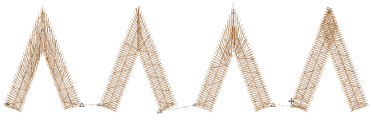

# Stitch quality improvements

The ES e4.2 software update includes the following stitch quality improvements…

## Stitch processing

Some users like to use the Process Stitches function to adjust overall stitch density in objects and designs. Pull compensation and dimensions can be adjusted the same way. Some problems have been reported in the way this function behaves. These have been resolved in ES e4.2\. [See also Adjusting stitch densities.](../../Quality/quality/Adjusting_stitch_densities)

## Unwanted travel runs

Problems have been reported when using Mitre or Cap corners with Column C objects. Changing entry/exit points sometimes causes unwanted travel runs to appear. This problem has been resolved in ES e4.2\. [See also Controlling corner stitching.](../../Quality/quality/Controlling_corner_stitching)

Some Column C shapes have also been generating bad stitches. Odd travel runs appear between underlay and cover stitches outside the object boundary. This problem has been resolved in ES e4.2.

