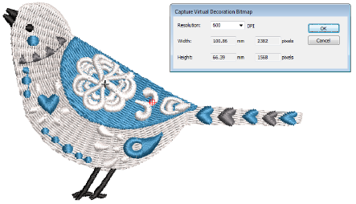
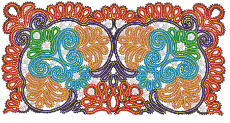
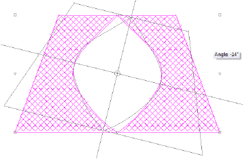

# System performance improvements

The ES e4.2 software update includes the following system performance improvements…

## Capture of high resolution ‘virtual decorations’

Problems have been reported when capturing virtual decoration bitmap at high resolution. The software may generate a ‘Not enough memory for the operation’ error and the PNG file is not created. This problem has been resolved in ES e4.2\. [See also Virtual embroidery.](../../Applied/mixed/Virtual_embroidery)

## Handling large design files

Problems have been reported when opening very large designs with thousands of stitches. Depending on the hardware, ‘Not enough memory’ messages can occur. This problem has been resolved in ES e4.2.

## Importing large image files

Similarly, problems have been reported when importing very large image files – BMP, JPG or PNG – for use as design backdrops. These can cause memory problems. They can be very slow to save or result in unusable design files. This problem has been resolved in ES e4.2.

## Rotating Cross Stitch objects

An ‘Access Violation’ has been reported when rotating cross stitch objects. This problem has been resolved in ES e4.2.

