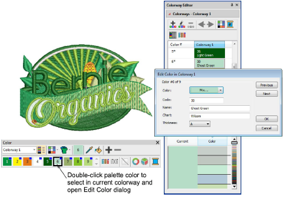
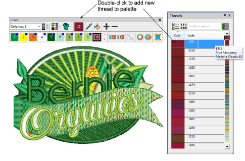
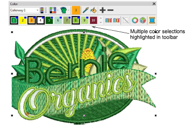
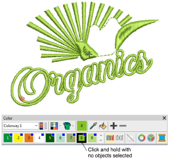
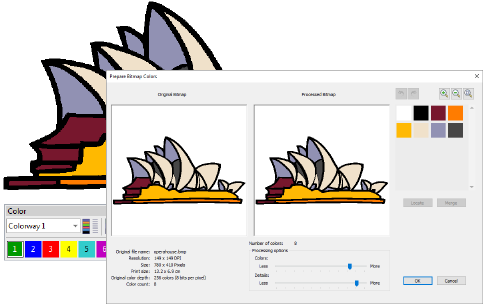

# Thread & color improvements

The ES e4.2 software update includes the following thread and color improvements…

## Improved color palette editing

The mechanism for editing palette colors on the Color toolbar has been revised and improved. Double-clicking and right-clicking is the traditional way for digitizers to access color editing. This is the method adopted for ES e4.2\. [See also Choosing threads.](../../Basics/threads/Choosing_threads)

Note the following changes:

- The name of the My Threads docker has changed to Threads.
- Right-click a palette color in the Color toolbar to open the Threads docker. If open, the Colorway Editor docker closes automatically.
- Double-click a palette slot to access the Edit Color dialog. The color is simultaneously selected in the Colorway Editor docker. The Threads docker closes automatically.
- When a color is changed, all objects using that color update immediately, whether selected or not. All other objects in the design remain unchanged.
- The Assign Thread button has been removed from the docker. Simply click a thread to assign it to the current color slot.
- Double-click to add a thread to the Color toolbar. The color is appended in a new color slot.

- The ‘Current Color’ on the Color toolbar is now more prominent.
- Multiple design colors contained in the current selection are now highlighted simultaneously in the toolbar.

- Thicker borders around selected colors make for more obvious color slot selection.

## Isolate color blocks

To isolate a color block in the design window, you can now click and hold it in the Color toolbar. First press Esc to deselect all objects. [See also View selected color blocks.](../../Basics/view/View_selected_color_blocks)

## New auto-scroll to selected object in Color-Object List

When an object is selected in the design window, the Color-Object List automatically scrolls to the object and expands any closed color nodes. This makes locating objects in the list easier and faster. [See also Selecting objects.](../../Basics/basics/Selecting_objects)

## Improved procedure for adding bitmap colors

Now when you invoke Graphics > Add Bitmap Colors, the Prepare Bitmap Colors dialog opens by default. This lets you reduce design colors to the minimum necessary before adding to the color palette. [See also Add & match image colors.](../../Automatic/bitmaps/Add_match_image_colors)

