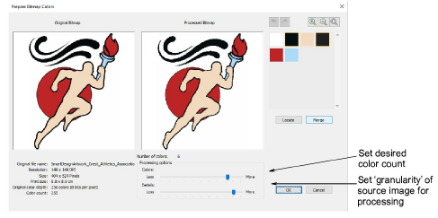

# Auto-digitizing improvements

The ES e4.5 software update contains significant improvements in auto-digitizing capabilities.

## Bitmap preparation

Bitmap preparation improvements have focused on the creation of logo-style designs for commercial decorators. Improvements include:

- Better sequencing
- Fewer color changes and trims
- Improved color reduction

## Stitch estimation

Again with and emphasis on the creation of logo-style designs for commercial decorators, ES e4.5 provides improvements in accurate stitch counts for quotes. This is to assist the growing trend (and cost) of outsourcing, as well as difficulties business owners and staff have in providing accurate estimates.
