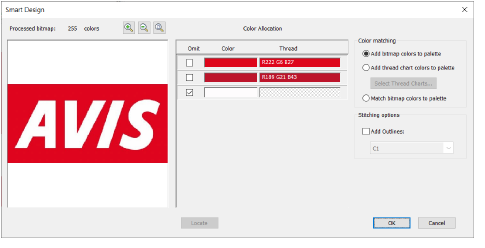
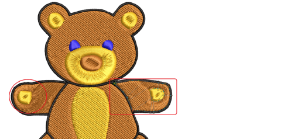

# Auto-digitizing improvements

The ES e4.5.1 software update includes the following auto-digitizing improvements…

## Branching of single objects in Smart Design

When using Smart Design, resultant single objects are being auto-branched unexpectedly. This problem has been resolved with the release of ES e4.5.1.

## Segmenting of backgrounds in Smart Design

With certain designs, large backgrounds are being segmented unexpectedly, irrespective of values set in the Smart Design dialog. This problem has been resolved with the release of ES e4.5.1.

## Unwanted stitch angles

Unwanted stitch angles are being added to some auto-digitized designs. This problem has been resolved with the release of ES e4.5.1.

