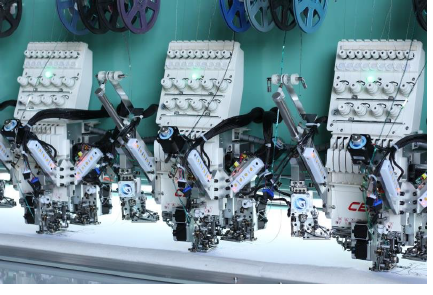

# Dahao support

In support of Dahao’s multi-sequin capabilities, EmbroideryStudio e4 provides the following support...

## Quadruple sequins for Dahao machine format

The Dahao embroidery machine control unit is capable of quad sequins on a single needle bar. ES e4.5 now supports ‘ABCD’ on the first needle, and ‘EFGH’ on the last.

