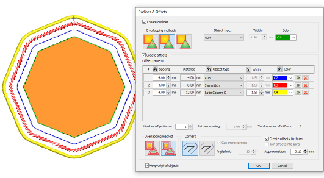
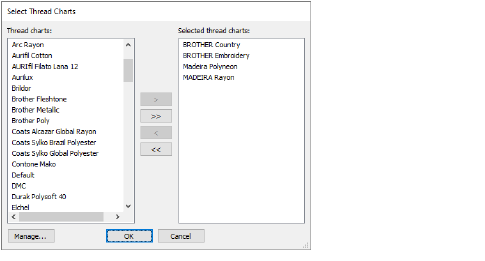
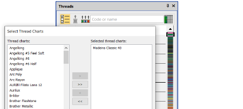

# Digitizing improvements

The ES e4.5.1 software update includes the following digitizing improvements…

## Outlines & offsets with vectors

The Outlines & Offsets feature now works with vector objects.

## New thread charts

With the release of ES e4.5.1, four new thread charts are included – Madeira Polyneon, Madeira Rayon, BROTHER Country, and BROTHER Embroidery.

## Thread chart colors unexpectedly turning to red and black

Problems have occurred in EmbroideryStudio e4 with thread chart colors turning to red and black shades following editing operations. This seems to have affected two Madeira charts in particular. The problem has been resolved with the release of ES e4.5.1.

