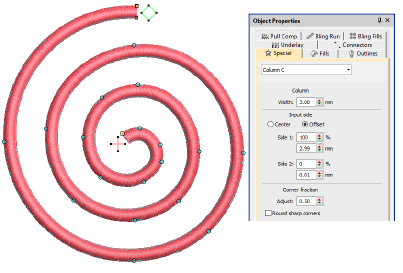
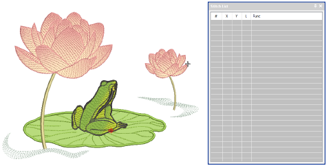
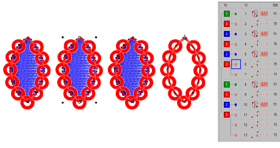

# Editing improvements

The ES e4.5.4 software update provides the following design editing improvements…

## Moving Column C input nodes in Reshape mode

A problem has been reported in relation to Column C objects. In Reshape mode with the offset at 100%, moving the first input node becomes problematic. This problem has been resolved with the current update.

## Related topics

- [Reshape objects with reshape-nodes](../../Modifying/reshape/Reshape_objects_with_reshape-nodes)
- [Reshape Column C objects](../../Modifying/reshape/Reshape_Column_C_objects)

## Stitch List display while digitizing

A problem has been reported with the Stitch List display. The list is not refreshing correctly while digitizing. This problem occurs when the number of stitches is less than the number of rows displayed without scrolling. This problem has been resolved with the current update.

## Related topics

- [Select stitches with the Stitch List](../../Modifying/functions/Select_stitches_with_the_Stitch_List)
- [Edit stitches](../../Modifying/functions/Edit_stitches)

## Color sequence errors with duplicate twin-color objects

A problem has been reported when duplicating twin-color objects. Duplicate objects are misplaced in the color-object sequence. This problem has been resolved with the current update.

## Related topics

- [Sequencing embroidery objects](../../Modifying/combine/Sequencing_embroidery_objects)

## Start and end points in TrueView

A problem has been reported in relation to the visibility of start and end points in TrueView. At 100% zoom, Start and End points are slightly hidden. At large zoom factors, they disappear. This problem has been resolved with the current update.

## Related topics

- [Setting auto start & end](../../Production/hoops/Setting_auto_start_end)
