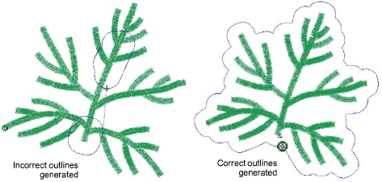

# Editing issues

The ES e4.5.5 software update provides the following editing improvements…

## Edit artwork using Paint disabled

A problem has been reported in relation to the ‘Graphics > Edit Using >...’ feature. This is being disabled on Windows 11 systems and the relevant option in the Graphics menu grayed out. The problem has been rectified with the current update.

## Stitch generation in branched Column A

A problem has been reported in relation to stitch generation in branched Column A objects. Stitches with Raised Satin fill are not being generated in certain cases. The issue may also affect lettering objects utilizing Raised Satin. This problem has been resolved with the current update.

## Branching producing unwanted trims/jumps

Another problem has been reported in relation to branching. EmbroideryStudio is producing unwanted connectors and trims. This problem has been resolved with the current update.

## Offset objects in branched objects

A problem has been reported in relation offset objects in branched objects. The issue meant that the Offset Outline tool would fail to correctly recognize the outline of a branched object. With the current update, it now generates a much better outline:

