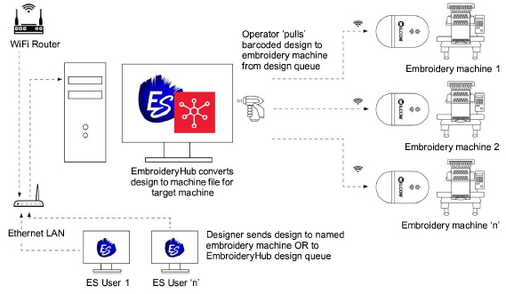

# EmbroideryConnect networking

Wilcom’s EmbroideryConnect network capability has just taken a giant leap forward with the new EmbroideryHub networking software and second generation EmbroideryConnect WiFi device. The concept behind the EmbroideryConnect network is described by the following diagram…

## EmbroideryHub

Quickly and easily send, scan, and queue your embroidery designs for production. EmbroideryHub software is included with the upgraded EmbroideryConnect element. [See Machine Networking for details.](../../Production/network/Machine_Networking)

## EmbroideryConnect

Now you can wirelessly manage and transfer embroidery designs from EmbroideryHub to the new second generation EmbroideryConnect WiFi device connected directly to your embroidery machines. Features include:

- Simple integration with your existing WiFi network.
- Color-coded LED light notifications.
- Barcode reader for super-fast design loading.

## Sending designs to the EmbroideryConnect network

|  | Use Standard > Send to EmbroideryConnect to send the current design to a named EmbroideryConnect device.                                  |
| ------------------------------------------------------------------ | ----------------------------------------------------------------------------------------------------------------------------------------- |
|                          | Use Standard > Queue Design to send the current design to the EmbroideryConnect design queue where they can be ‘pulled’ from the machine. |

Once you have set up one or more EmbroideryConnect devices on your network, you have the choice of ‘pushing’ designs or ‘pulling’ them from the EmbroideryHub. The new Send to EmbroideryConnect button allows you to send a design to a named EC device. Alternatively, use the Queue Design to ‘push’ designs to a queue where they can be ‘pulled’ from the machine itself. [See Sending designs to EmbroideryConnect for details.](../../Production/network/Sending_designs_to_EmbroideryConnect)
