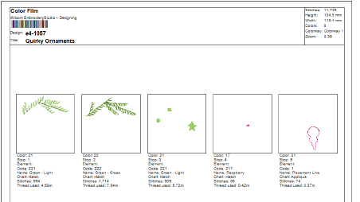

# General improvements

The ES e4.5.5 software update provides the following general improvements…

## GEM thread chart

The GEM thread chart has been added to EmbroideryStudio and is available from the Thread Charts dialog.

## Stop # returned to Color Film worksheet

Stop # information is useful when setting up threads on the machine. With the current update, Stop # information has been returned to the Color Film worksheet at top of the existing color slot number.

