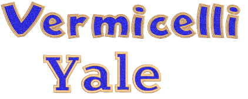
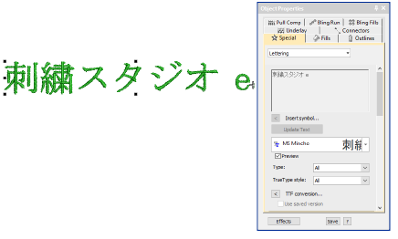
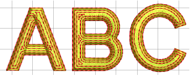

# Lettering improvements

The ES e4.5.4 software update provides the following improvements to embroidery lettering…

## Faux chenille fonts

It is possible to modify Stipple Stemstitch Fill settings for a dense coverage. Combined with a thicker thread type such as Madeira’s Burmilana thread, it is possible to achieve a chenille effect. These dedicated fonts utilize this tested technique to create perfect faux chenille lettering. The latest release includes two new ‘faux chenille’ fonts – Vermicelli and Yale.

- [Creating embroidery lettering](../../Lettering/lettering_create/Creating_embroidery_lettering1)

## MS Mincho TTF conversion

A number of problems have been reported in regards to conversion of MS Mincho TrueType font. Some letters become bunched at the end of lettering objects. Where there is a mixture of Kanji and Kana (Katakana or Hiragana) characters, text spacing may be uneven. Uneven spaces can also produce overlapping text. Empty lines are ignored. These problems have been resolved with the release of ES e4.5.4.

## Related topics

- [Converting TrueType fonts to embroidery](../../Lettering/lettering_custom/Converting_TrueType_fonts_to_embroidery)

## Offsets/outlines around Block2 font

In earlier versions, unexpected results may occur when using offsets/outlines around Block2 font. This problem has been resolved with the current update.

