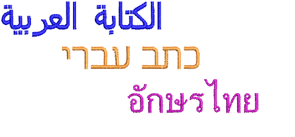
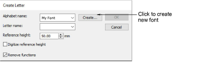
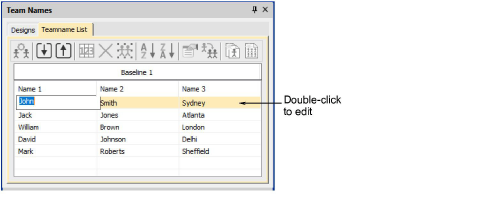
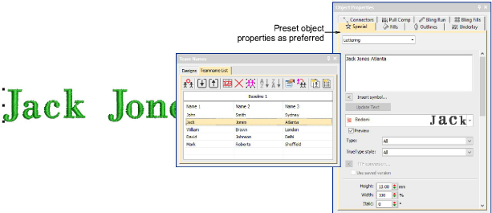

# Lettering improvements

The ES e4.5.1 software update includes the following lettering improvements…

## Support for complex text layouts

ES e4.5.1 now provides support for ‘complex text layout’ (right-to-left) and non-European scripts including Arabic, Hebrew, and Thai.

With ‘RTL languages’ like Arabic and Hebrew, the order of characters is correctly rendered in the generated lettering objects. Complex text rendering is also supported in other languages which include combined characters. [See also Select embroidery fonts.](../../Lettering/lettering_create/Select_embroidery_fonts)

## Ten (10) new fonts packaged

Ten (10) new fonts have been packaged with the latest update. These include:

- Albert
- Bounty
- Gypsy
- Lila
- Pastille
- Python Script
- Scope
- Spatial
- Vivid Script
- Yama

## Last used font name remembered

The Create Letter dialog now remembers and displays the last selected font name. This is a useful productivity enhancement when creating multiple sets of new letters. The same details no longer have to be unnecessarily re-entered. [See Create custom letters for details.](../../Lettering/lettering_custom/Create_custom_letters)

## Editing names in Teamname List

Previously, when selecting a name in the Teamname List, it became editable. Now it remains highlighted and cannot be edited unless you double-click.

## Changing stitch properties for lettering

With the latest release, you can preset object properties before adding members to your teamname list. This applies to both Team Names and other lettering objects. If you choose a fill that is not applicable to lettering, the system will default to the first applicable fill, usually Satin.

