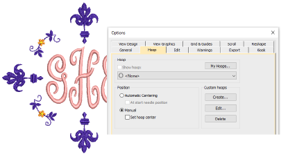
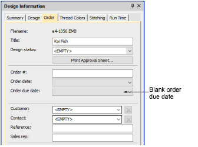
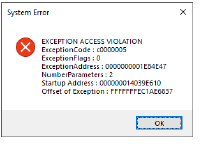
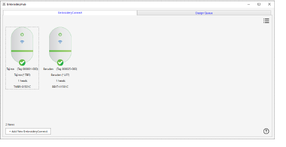
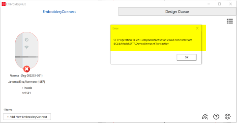

# Machine connection improvements

The ES e4.5.4 software update provides the following improvements in relation to machine connections…

## Hoop lost after saving and reopening an EMB design file

In earlier versions, the hoop saved with an EMB design file could be lost after re-opening the design. As a result, the software fails to validate the design size when the design is exported to machine formats. This problem has been resolved in e4.5.4.

## Related topics

- [Machine files](../../Basics/basics/Machine_files)
- [Exporting designs for machine](../../Production/output/Exporting_designs_for_machine)

## A05 error sending designs with empty ‘order due date’

A problem has been reported when loading U03 designs to new K-Series Barudan machines. The machine generates an A05 error and will not read the design if the ‘Order Due Date’ field is left blank. This problem has been resolved with the current update.

Note: This is only an issue with Barudan’s newest K-Series machines, which fully read all the extra data in the U03 file. Older Bardan models ignore the empty field.

## Related topics

- [Sending designs to machine](../../Production/output/Sending_designs_to_machine)

## Machine Manager crashes when invoking About box

Machine Manager crashes have been reported when invoking the About box. This problem has been resolved with the current update.

## Related topics

- [Sending designs to machine](../../Production/output/Sending_designs_to_machine)

## EmbroideryHub crashes at network dongle user limit

A problem has been reported with EmbroideryHub while running it at the network dongle user limit. If too many instances of EmbroideryStudio are running simultaneously, EmbroideryHub terminates without warning. This problem has been resolved with the current update.

## Related topics

- [Network overview](../../Production/network/Network_overview)
- [EmbroideryConnect setup](../../Production/network/EmbroideryConnect_setup)

## Failed SFTP operation in EmbroideryHub

A problem has been reported following the EmbroideryHub ES e4.5.1 R2 firmware update. EmbroideryHub fails to recognize the EC device. Deleting the device and setting up again appears to fix This problem but the device may fail to send designs. If it stops working, unplug, reconnect, and try again.

## Related topics

- [Network overview](../../Production/network/Network_overview)
- [Sending designs to EmbroideryConnect](../../Production/network/Sending_designs_to_EmbroideryConnect)

## EC device firmware updates

The EC 1.1.0 firmware update (and all subsequent update files) is larger than the maximum device storage size of 32MB. This results in an error when trying to start the update process. This problem has been resolved with the current update.

Note: There is a new firmware update for the EC device. It is highly recommended to update your EC device firmware.

## Related topics

- [EmbroideryConnect setup](../../Production/network/EmbroideryConnect_setup)
- [Update the firmware](../../Production/network/Update_the_firmware)
