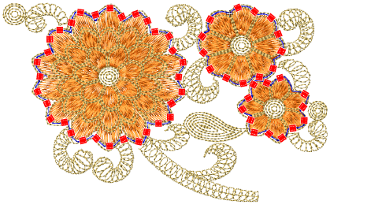
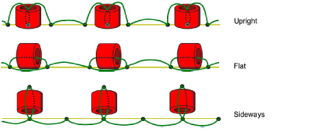
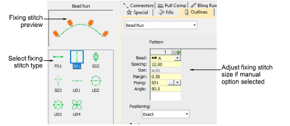

# New Beading Element

| Element                                                                                                               |         | 1                                                                                                                       | 2   | 3   | 4   | 5   |     |
| --------------------------------------------------------------------------------------------------------------------- | ------- | ----------------------------------------------------------------------------------------------------------------------- | --- | --- | --- | --- | --- |
|                                                                                     | Beading | Provide support for beading devices. Four fixing methods are available: Upright, Laid, and Above or Below the run line. | m   | m   | –   | –   | –   |
| 1 ES Designing 2 ES Digitizing 3 ES Decorating 4 ES Editing 5 ES Lettering l Included as standard m Modular ‘element’ |         |                                                                                                                         |     |     |     |     |     |

With the release of this update, EmbroideryStudio e4 includes the new specialty Beading Element which provides support for beading devices, single and mulitple. [See Bead Embroidery for details.](../../Applied/beading/Bead_Embroidery)

## Fixing stitch support

Various layout methods are available on the machine. EmbroideryStudio supports the classic fixing stitch types – ‘upright’, ‘flat’, and ‘sideways’ – and others. [See Bead fixings for details.](../../Applied/beading/Bead_fixings)

In addition to the classic fixing stitch types, the Beading feature includes a range of decorative fixing stitches for use in bead runs or individual bead drops. [See Apply bead fixings for details.](../../Applied/beading/Apply_bead_fixings)

Tip: Before using the Bead tools, you need to choose a suitable [machine format](../../glossary/glossary). Only some machine formats support beading – e.g. Tajima TBF, Dahao and SWF Twin Sequin. Refer to your machine manual for information about support for this type of decoration. [See also Bead encoding & decoding.](../../Applied/beading/Bead_encoding_decoding)
