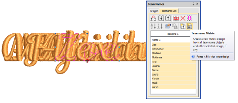
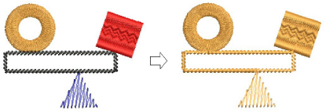
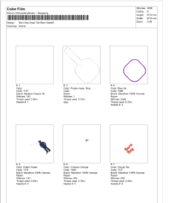

# Other improvements

The ES e4.5.4 software update provides the following miscellaneous improvements…

## Crash occurring with Teamname Matrix

An intermittent problem has been reported when applying Teamname Matrix to team names copied from the clipboard to Quick Names. This problem has been resolved with the current update.

## Related topics

- [Create a matrix of designs](../../Lettering/lettering_names/Create_a_matrix_of_designs)

## Auto-digitized stitch angles in complex fill objects

A problem has been reported in regards to Auto-Digitizing tools. Generated complex fill objects are frequently assigned a stitch angle of 45° rather than turning stitching. This problem has been resolved with the current update.

## Related topics

- [Auto-digitizing artwork](../../Automatic/automatic/Auto-digitizing_artwork)

## Branched objects containing Complex Fill

A problem has been reported where the software fails after generating stitches for branched objects containing Complex Fill. This problem has been resolved with the current update.

## Related topics

- [Automatic branching](../../Quality/connectors/Automatic_branching)

## Color film display when inserting Stops

A problem has been reported with thread color display in the Color film after inserting Stops. Additional boxes are added to the Color Film, one for each stop. This problem has been resolved with the current update.

## Related topics

- [Printing design reports](../../Production/reports/Printing_design_reports)
- [Stop sequence options](../../Production/reports/Stop_sequence_options)

## Memory leaks

A problem has been reported in regards to ‘memory leaks’ causing sluggish system performance. This problem has been resolved with the current update.
