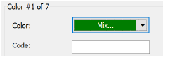

# Other machine file issues

The ES e4.5.5 software update provides the following machine file improvements…

## System crashes with JEF files

Problems have been reported when opening JEF files. System crashes occurred when invoking the Open Options dialog for JEF format designs, with or without object recognition activated. The problem has been rectified with the current update.

## Trims in PES files

Problems have also occurred where additional jumps/trims are being inserted in exported PES files. This problem has been resolved with the current update.

## A05 error sending designs with empty color code

A problem has been reported when loading U03 designs to new K-Series Barudan machines. The machine generates an A05 error and will not read the design if the ‘Code’ field is left blank. This problem has been resolved with the current update.

