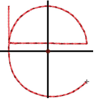

# PES file improvements

The ES e4.5.4 software update provides the following improvements in relation to PES files…

## Unwanted stitches in PES designs

An intermittent problem has been reported when exporting to PES file format. The software sometimes adds stitch runs from the center of the design. While the unwanted lines don’t appear in EmbroideryStudio, they appear in stitchout. This problem has been resolved with the current update.

## Related topics

- [Machine files](../../Basics/basics/Machine_files)
- [Exporting designs for machine](../../Production/output/Exporting_designs_for_machine)

## Unwanted penetrations at start of PES files

A problem has been reported with unwanted penetrations appearing at the start point of PES files. This occurs when the first stitch is within 12.7mm of the start point at the top-left of design extents. This problem has been resolved with the current update.

## Related topics

- [Machine files](../../Basics/basics/Machine_files)
- [Exporting designs for machine](../../Production/output/Exporting_designs_for_machine)
