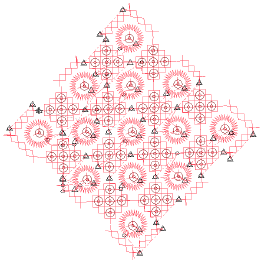
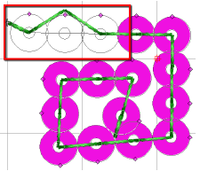
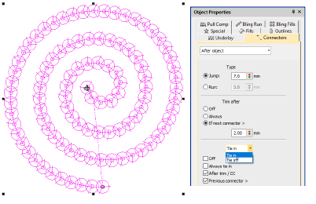

# Sequin improvements

The ES e4.5.4 software update provides the following improvements in relation to sequins…

## Changing machine formats while digitizing sequins

A problem has been reported when changing machine formats while digitizing sequin runs. This problem occurs after resizing a Sequin Run object or regenerating stitches after changing machine formats – e.g. Barudan FDR-II Twin Sequin. Pressing Undo can cause the object to disappear or crash the software. This problem has been resolved with the current update.

## Related topics

- [Embroidery machine formats](../../Basics/basics/Embroidery_machine_formats)

## Unwanted trims added after sequins

A problem has been reported in relation to unwanted trims after sequin drops. When selecting a design and applying a sequin from the palette, trims are added, stitches distorted, and stitching sequence broken. This problem has been resolved with the current update.

## Related topics

- [Visualizing sequin designs](../../Applied/sequin_basics/Visualizing_sequin_designs)
- [Editing sequin runs](../../Applied/sequin_basics/Editing_sequin_runs)
- [Editing sequin fills](../../Applied/sequin_advanced/Editing_sequin_fills)

## Disappearing sequins when stitch editing

A problem has been reported when using Stitch Edit with sequin runs. Sequins disappear when stitches are reshaped. This problem affects sequin runs created with Sequin Run Auto as well as Sequin Run Manual. This problem has been resolved with the current update.

## Related topics

- [Visualizing sequin designs](../../Applied/sequin_basics/Visualizing_sequin_designs)
- [Editing sequin runs](../../Applied/sequin_basics/Editing_sequin_runs)
- [Editing sequin fills](../../Applied/sequin_advanced/Editing_sequin_fills)

## Assigning connector properties to Sequin Run objects

A problem has been reported when attempting to assign connector properties to Sequin Run objects. The Object Properties docker accepts new values but then reverts to the old ones. This problem has been resolved with the current update.

## Related topics

- [Using automatic connectors](../../Quality/connectors/Using_automatic_connectors)
- [Minimizing connectors](../../Quality/connectors/Minimizing_connectors)
