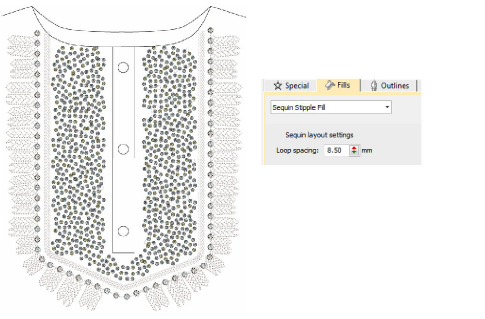
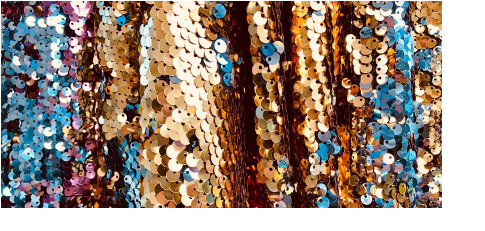
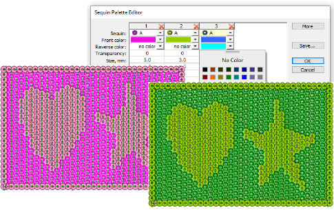
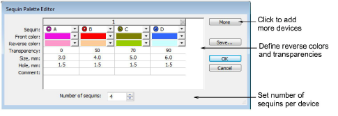
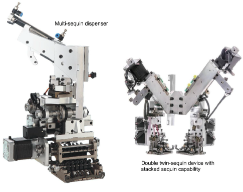
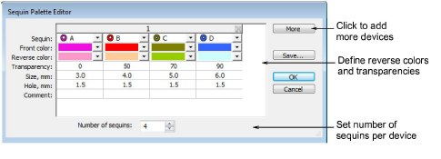
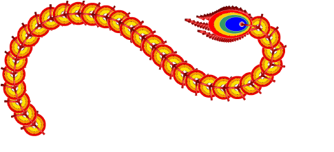
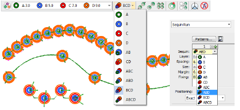

# Sequin improvements & new features

The ES e4.5 software update also contains some exciting developments in sequin digitizing to exploit the cutting edge sequin placement capabilities of the latest machines and controllers. New features are summarized as follows...

## Related topics

- [Sequin stipple fill](#XREF_12530_Sequin_stipple_fill)
- [Flip sequins](#XREF_79791_Flip_sequins)
- [Multi-sequin support](#XREF_88292_Multi_sequin)
- [Stacked sequins](#XREF_10107_Stacked_sequins)

## Sequin stipple fill

Create variegated stipple fills automatically with single or multi-color sequin patterns. These can be reshaped and resized like any embroidery object. [See Fancy sequin fills for details.](../../Applied/sequin_advanced/Fancy_sequin_fills)

## Flip sequins

|  | Use View > Flip Sequins to toggle between front and reverse sides of sequin runs and fills in reversible sequin designs. Define colors in the Sequin Palette Editor. |
| ------------------------------------------ | -------------------------------------------------------------------------------------------------------------------------------------------------------------------- |

Flip sequins, also known as reversible sequins, are a color-changing effect which has become very fashionable. Beginning with children’s wear, flip sequins have found a wide variety of applications, from reversible sequin shirts, pillow cases, bags, cases, note books, and more. Their use is very simple – swipe up or down to reveal the reverse side, with sometimes surprising effects. A simple pink sequined heart on a plain T-shirt can suddenly turn purple at the touch. Reverse sequin use has also found its way into high fashion.

The software now allows you to define as many flip sequins as your machine will support, from as little as a single flip sequin, to 2-sequin, 4-sequin, 6-sequin or even 8-sequin devices. The Flip Sequin control allows you to visualize fills created with flip sequins. You can even design your own sequin and offset hole. [See Visualizing sequin designs for details.](../../Applied/sequin_basics/Visualizing_sequin_designs)

## Multi-sequin support

EmbroideryStudio currently provides support for twin-sequin machines. However, Dahao machine controllers now support a much higher number of attached sequin devices. ES e4.5 provides multi-sequin support for machines with 4-sequin, 6-sequin or even 8-sequin devices. [See Setting up sequin palettes for details.](../../Applied/sequin_basics/Setting_up_sequin_palettes)

## Machine capabilities

An increasing number of commercial machines can support various devices for additional decorative effects. The multi-sequin support now provided by ES e4.5 is designed to exploit the latest machine capabilities.

The main sequin device configurations include...

- Machines supporting one sequin per device. These feed only one sequin at a time.
- Machines supporting one or two devices per machine head, usually on first or last needles.
- Machines supporting twin-sequin devices with no stack feeding – e.g. Barudan FDR-II Twin Sequin, Tajima TBF, SWF Twin Sequin.
- Machines supporting twin-sequin devices or even double twin-sequin devices with stack feeding – e.g. Dahao.
- Machines supporting multiple sequins per device – four, six, eight, and possibly more sequins – with or without stack feeding.

Note: An increasing number of machines support multiple decoration types including sequins in combination with chenille, beading, cording, and others.

## Machine formats

ES e4.5 supports the following sequin-capable machines:

| Machine format                                  | Sequin capability | File format |
| ----------------------------------------------- | ----------------- | ----------- |
| Barudan FDR-3                                   | Twin              | U??         |
| Barudan FDR-3 Chenille Combination              | Twin              | U??         |
| Barudan FDR-II Twin Sequin                      | Twin              | U??         |
| Barudan FDR-II Twin Sequin Chenille Combination | Twin              | U??         |
| Dahao                                           | Multiple          | DST (Dahao) |
| Schiffli                                        | Single            | ESS         |
| SWF                                             | Single            | DST         |
| SWF Twin Sequin                                 | Twin              | EBD         |
| Tajima                                          | Single            | DST         |
| Tajima TBF                                      | Twin              | TBF         |
| ZSK                                             | Single            | ZSK         |

## Sequin palette editor

In order to exploit multi-sequin machine capabilities, the Sequin Palette Editor has been updated as shown...

The following changes have been made:

- Up to 8 sequins per device can be specified.
- Colors can be defined for both front and reverse sides.
- A transparency factor from 0 to 90 can be defined for each sequin.

Set number of sequins per device. Sequin devices are normally attached to the first or last needle on the machine head. Sometimes both. (There may be multiple heads on the machine.)

## Stacked sequins

|        | Use Sequin > Manual Sequin to digitize individual sequins.                                                       |
| -------------------------------------------------- | ---------------------------------------------------------------------------------------------------------------- |
|      | Use Sequin > Sequin Run Auto to create a string of sequins along a digitized line according to current settings. |
|  | Use Sequin > Sequin Run Manual to manually digitize sequin-drops along a digitized line.                         |

For those machines that support it, ES e4.5 allows you to define multiple sequin drops on the same needle. Fixing stitches are only applied after all sequins have been dropped. [See Stacked sequins for details.](../../Applied/sequin_basics/Stacked_sequins)

Stacked sequins can be used with Manual Sequin and Sequin Run digitizing methods. Permutations are automatically defined according to the sequin palette.

