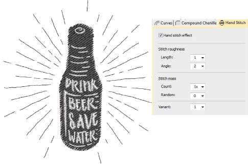
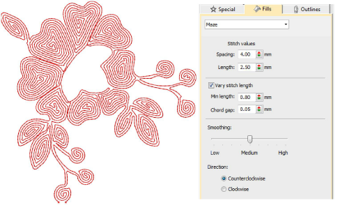
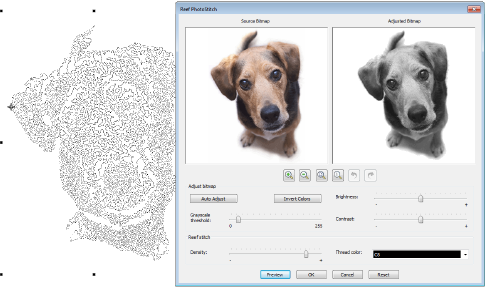

# Stitching improvements & new features

The ES e4.5 software update contains some exciting new stitch effects, with an emphasis on a more naturalistic, organic style of stitching, placing it at the cutting edge of contemporary embroidery digitizing. New features are summarized as follows...

## Related topics

- [New Hand Stitch](#XREF_20876_New_Hand_Stitch)
- [New Maze Fill](#XREF_51552_New_Maze_Fill)
- [New Reef PhotoStitch](#XREF_59337_New_Reef)

## New Hand Stitch

|  | Use Stitch Effects > Hand Stitch to create hand-stitch effects which combine randomized spacing and stitch angles. Can be applied to satin, tatami, run, backstitch, and other stitch types. |
| ---------------------------------------------------- | -------------------------------------------------------------------------------------------------------------------------------------------------------------------------------------------- |

Tired of perfect machine stitching every time? Fashion trends sometimes favor a more organic look which is very hard to achieve with current design tools. With the new Hand Stitch effect, you can easily and intuitively create hand-stitch effects which combine randomized spacing and stitch angles. This powerful new stitch effect can be applied to a variety of stitch types, including satin, tatami, run, backstitch, and others. [See Hand stitch effect for details.](../../Decorative/specialty/Hand_stitch_effect)

## New Maze Fill

|  | Use Fill Stitch Types > Maze Fill to create maze-like stitching that never intersects. Right-click for settings. |
| ---------------------------------------------- | ---------------------------------------------------------------------------------------------------------------- |

New Maze Fill offers a double-spiral stitch that never crosses or jumps over itself. Automatically fill large areas with this unique stitch type. [See also Maze fills.](../../Decorative/specialty/Maze_fills)

## New Reef PhotoStitch

|                      | Use Auto-Digitizing > Photo Flash to create embroidery designs directly from photographs.                          |
| ------------------------------------------------------------ | ------------------------------------------------------------------------------------------------------------------ |
|  | Use Auto-Digitizing > Reef PhotoStitch to turn photographs into a single embroidery field resembling a coral reef. |

New Reef PhotoStitch expands on the Photo Flash auto-digitizing method to convert a photos into embroidered designs. Automatically fill large areas with open stitching reminiscent of a coral reef. Like Maze Fill, this stitch never intersects itself. Adjust to the stitch resolution of choice. [See also Auto-digitize with Reef PhotoStitch.](../../Automatic/automatic/Auto-digitize_with_Reef_PhotoStitch)

