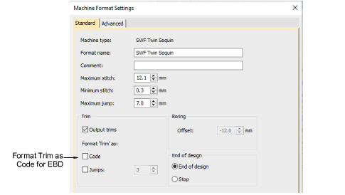
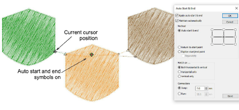
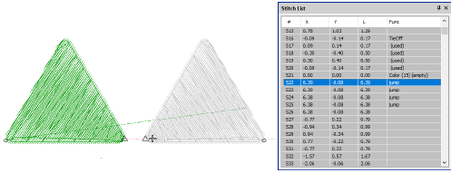

# System & file improvements

The ES e4.5.1 software update includes the following improvements…

## Unexpected crashes

Unexpected software crashes have occurred in EmbroideryStudio e4 when...

- Opening some DST, INB, and ESS designs
- Resizing certain EMB designs
- Using the B key to zoom onto selected areas.

The problem has been resolved with the release of ES e4.5.1.

## PES file start and end points

A problem has been reported when outputting PES files from EMB. Auto start and end points are not being properly maintained, causing the design to be off center. This problem has been resolved with the release of ES e4.5.1.

## SWF (EBD) file format

The Wilcom SWF file format has been updated to support the latest version of EBD. Accordingly, the SWF Twin Sequin machine format includes a new trim format setting. You can now output ‘Trim’ as ‘Code’.

## Auto-centering stitch cursor

Previously the stitch cursor always defaulted to the end of a design including start end connectors. With this release, the stitch cursor adjusts to the end of the last digitized object, not the auto-end point. If the object has a tie-off, the cursor jumps to the end of the tie-off instead of the beginning. All input methods behave the same way. Auto start and end symbols have been added – a green circle and a red cross. These are activated via Options > View Design.

## Jump functions in the Stitch List

When digitizing objects with large jumps, the Stitch List now correctly shows Jump functions.

