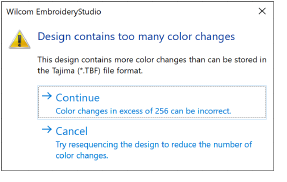
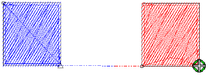
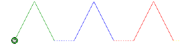

# TBF machine file issues

The ES e4.5.5 software update provides the following TBF machine file improvements…

## Color sequence in TBF files

A problem has been reported in relation to color sequence in TBF files. When exporting a design containing more than 72 color changes or stops, the color sequence is incorrect. This problem has been resolved with the current update which now allows up to 256 color changes. Note, however, TBF format has a limit of 256 color changes. If the design exceeds this, EmbroideryStudio will now display the following warning:

## Tajima TBF connector color changes

A problem has been reported in relation to unwanted color changes in Tajima TBF files occurring half-way along the connector. The connector should appear in the color of the second object. This problem has been resolved with the current update.

## Missing data in TBF machine files

Two problems have been reported in relation to TBF machine files:

1\. The software fails to insert trims between objects of different colors.

2\. When loading a TBF file, the initial penetration is missing.

These problems have been resolved with the current update.

## Team name problem with TBF machine files

A problem has been reported in relation to teamname designs utilizing TBF machine format. The issue here was that the exported machine file contained unwanted needle penetrations at each point where a stop was added between names. This problem has been resolved with the current update.
