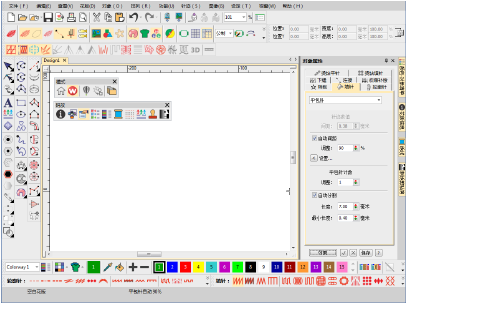
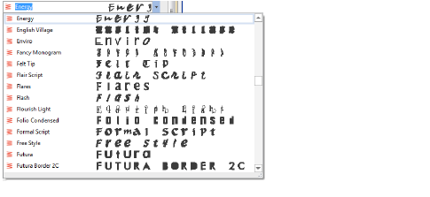

# What’s new in ES e4.5.2?

The ES e4.5.2 software update includes the following general improvements…

## Installation crashes after accepting EULA

A problem was reported when running the ES e4.5 installation after accepting the ‘Terms and Conditions’. The has been resolved with the release of ES e4.5.2.

## Addition of Chinese Simplified interface

Simplified Chinese has been added to the main Wilcom ES e4.5.2 product interface.

## Setta Lumina thread chart

The Setta Lumina thread chart has been added to ES e4.5.2.

## Font preview

There have been reports that the font preview is slow when opening the Lettering tab and scrolling through the font list. The problem has been resolved with the release of ES e4.5.2.

## Offsets with lettering objects

|      | Use Toolbox > Simple Offsets to create simple outlines for any filled embroidery or closed vector object.                      |
| -------------------------------------------------- | ------------------------------------------------------------------------------------------------------------------------------ |
|  | Use Toolbox > Outlines & Offsets to create outlines and offsets of any type for any filled embroidery or closed vector object. |

There have been reports of offsets not being properly created in certain lettering designs, including objects created from simple outline fonts. The problem has been resolved with the release of ES e4.5.2\. [See also Generating outlines & offsets.](../../Modifying/productivity/Generating_outlines_offsets)

## Break apart Japanese lettering

Problems have been reported when breaking apart Japanese lettering objects with the Break Apart tool. Native Japanese (ESA) fonts are being immediately broken into individual patches rather than characters. With the release of ES e4.5.2, lettering is correctly broken apart in stages – words, letters and then patches.

## Regeneration of large manual sequin objects

Regeneration of large manual sequin objects can be very slow. When opening sequin machine files without object recognition, it can take a long time to regenerate stitches. The problem has been resolved with the release of ES e4.5.2\. [See also Sequin Embroidery.](../../Applied/sequin_basics/Sequin_Embroidery)

