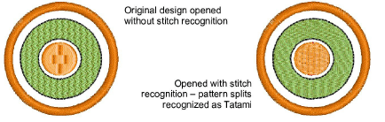
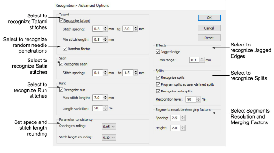
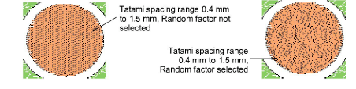
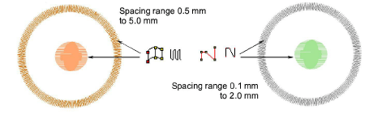
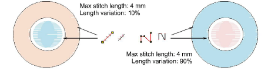
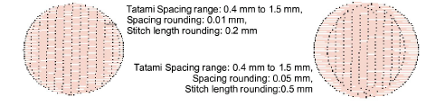
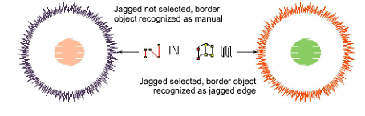
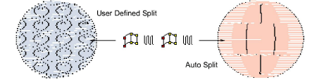
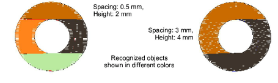

# Advanced recognition settings

You can fine-tune how EmbroideryStudio converts machine files using advanced recognition options. By default, EmbroideryStudio converts stitches as Tatami, Satin, or Run stitches according to the settings in the Recognition - Advanced Options dialog. You can change these values, or choose not to convert certain stitch types at all. Generally, the [default settings](../../glossary/glossary) provide the best results for the most frequently used fill styles – Tatami and Satin – their [properties](../../glossary/glossary#properties) – stitch length and spacing – and edge effects, such as stitch shortening. Default settings, however, cannot always guarantee the best results as the variety of embroidery designs is virtually unlimited.

## To adjust advanced recognition settings...

1. Access the Open Options dialog and click Advanced.

The Recognition - Advanced Options dialog opens.

## To adjust Tatami recognition settings...

- In the Tatami panel, select Recognize tatami in order to process tatami fills, and adjust conversion options:

| Option            | Function                                                                                                                             |
| ----------------- | ------------------------------------------------------------------------------------------------------------------------------------ |
| Stitch spacing    | Enter spacing range to recognize. If the row spacing falls outside this range it will not be converted to tatami.                    |
| Min stitch length | Enter minimum stitch length to recognize as tatami.                                                                                  |
| Random factor     | Select to allow for random needle penetrations. Tip: Deselect the Recognize Splits checkbox to detect Random Factor more accurately. |

## To adjust Satin recognition settings...

- In the Satin panel, select Recognize satin in order to process satin stitching, and adjust stitch spacings as required. If the row spacing falls outside the specified range it will not be converted to satin.

## To adjust Run recognition settings...

- In the Run panel, select Recognize run in order to process run stitching, and adjust conversion options as required:

| Option            | Function                                                         |
| ----------------- | ---------------------------------------------------------------- |
| Max stitch length | Enter maximum stitch length to recognize.                        |
| Length variation  | Enter percentage by which stitch length can vary in run objects. |

## To adjust Complex Fill recognition settings...

- In the Parameter consistency panel, set options for complex fill segment recognition:

| Option                 | Function                                                                                                             |
| ---------------------- | -------------------------------------------------------------------------------------------------------------------- |
| Spacing rounding       | Enter rounding value for stitch spacings – ‘snaps’ spacing values in Tatami and Satin fills to specified increments. |
| Stitch length rounding | Enter rounding value for stitch lengths – ‘snaps’ stitch length values in Tatami fills to specified increments.      |

For example, if the Tatami [minimum stitch length](../../glossary/glossary#minimum-stitch-length) is 4 mm, and Stitch length rounding is 0.4 mm, stitches from 3.80 to 4.20 mm are ‘snapped’ to 4.0 mm, and recognized as Tatami.

## To adjust stitch effects recognition settings...

- In the Effects panel, select Jagged in order to recognize the Jagged edge effect. Specify a minimum range in millimeters – anything variation greater than this value will be recognized as Jagged edge.

- In the Splits panel, select Recognize splits to recognize splits in tatami fills, and adjust conversion options as required:

| Option                                | Function                                                                                                                                                                                                                                                                                                                                                     |
| ------------------------------------- | ------------------------------------------------------------------------------------------------------------------------------------------------------------------------------------------------------------------------------------------------------------------------------------------------------------------------------------------------------------ |
| Program splits as user defined splits | Recognize split patterns as user-defined splits. Note, however, that user-defined splits are scaled when the design is scaled. This results in stitch lengths getting longer as the design is enlarged, thus limiting scaling. With native program splits, on the other hand, patterns – shape, size and spacing – remain the same after objects are scaled. |
| Recognize auto splits                 | Recognize Auto Splits in Satin objects. Otherwise, patterns created with Auto Split will be recognized as Tatami.                                                                                                                                                                                                                                            |
| Recognition level                     | Restrict recognition of Program Splits by increasing percentage. Decrease to increase recognition. A low percentage number will detect more areas as Satin with User Defined Split than Tatami.                                                                                                                                                              |

::: tip
Program splits are reliably recognized when patterns are not overlapping. Split patterns can be complex, so the recognition process can take up to five times longer with this option.
:::

## To adjust segment recognition settings...

- In the Segments resolution/merging factors panel, enter values to fine-tune the recognition of segments and objects:

| Option  | Function                                                                                                                                                                                                                                                                                                                                                                                                                                                                                                                                                                                                                                                                                                                                                           |
| ------- | ------------------------------------------------------------------------------------------------------------------------------------------------------------------------------------------------------------------------------------------------------------------------------------------------------------------------------------------------------------------------------------------------------------------------------------------------------------------------------------------------------------------------------------------------------------------------------------------------------------------------------------------------------------------------------------------------------------------------------------------------------------------ |
| Spacing | This value expresses the ratio between stitch spacings in adjacent stitch blocks – e.g. adjacent spacings of 0.6 mm and 1.0 mm gives a ratio of 1.67\. A value of 2.0 in the Spacing field means that these stitch blocks will be recognized as one segment or object. A value of 1.5 means that they will not. The default value is 3.0\. Normal Satin and Tatami stitching ranges in spacing from 0.3 to 0.6 mm, so most continuous sections of stitching of the same type will not be split. To preserve spacing variations for color-blended designs and more artistic designs, you may need to reduce the spacing factor. In manually punched designs which include stitching with irregular spacing, segment breaks can be reduced by increasing the factor. |
| Height  | This value expresses the ratio between heights of stitch blocks. It is important in recognizing Complex Fill shapes, particularly with holes.                                                                                                                                                                                                                                                                                                                                                                                                                                                                                                                                                                                                                      |

::: tip
Generally, the lower these values, the larger the number of segments/objects likely to be identified. Normally you want to obtain design information with a minimum number of identified segments/objects. In practice there is always a compromise between design recognition quality and the minimum number of correctly identified segments/objects.
:::

- Click OK.

::: tip
To revert to the original conversion settings, click Reset.
:::

## Related topics...

- [Open machine files](Open_machine_files)
