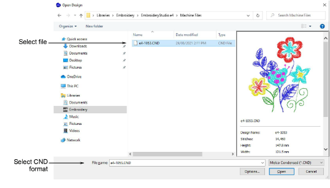
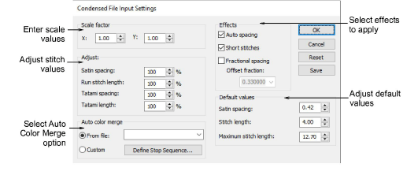
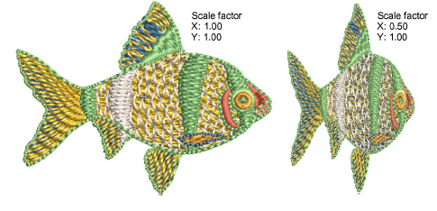

# Convert CND files to EMB

There are several versions of CND, all of which can be read by EmbroideryStudio. While these designs scale accurately, the number and placement of stitches may differ somewhat from the original design. You may notice some difference (±10%) in the stitch counts between original and converted files. This is because of differences in the software methods used to calculate stitches. EmbroideryStudio cannot interpret certain specialty features of CND design objects because there is no direct equivalent. However, stock designs do not normally use these features and will generally convert without problem.

When you open Melco CND files, the Melco stitch types used in the design are converted to EmbroideryStudio stitch types – satin, run, tatami, etc. You can change conversion settings to adjust spacing, stitch length, effects and defaults applied to EmbroideryStudio stitch types. You can also set scaling values to open the design at a different size to the original.

## To convert a CND file to EMB...

1. Open the file from your hard disk, or read it from tape or [embroidery disk](../../glossary/glossary#embroidery-disk).

2. Select the Melco (CND) file to open and click Options. The Condensed File Input Settings dialog opens.

3. In the Scale factor panel, enter the scale at which you want to open the design.

New dimensions are expressed as a ratio of the original design size. For example, to scale to 120% of the original, enter a scale factor of 1.2 in each field.

4. In the Adjust panel, enter spacing and length values to apply to the design as a percentage of original values. You can adjust satin spacing, run stitch length as well as tatami spacing and length.

5. In the Auto color merge panel, choose whether you want to read thread color information from CND files. This ensures that stitches are displayed in the correct colors when converted to EMB.

6. In the Effects panel, select the effects you want to apply to the design.

For information about these, see the relevant sections of the manual:

| Option             | Function                                                                                                                                                                                                                                                                                                                                                                                                                                            |
| ------------------ | --------------------------------------------------------------------------------------------------------------------------------------------------------------------------------------------------------------------------------------------------------------------------------------------------------------------------------------------------------------------------------------------------------------------------------------------------- |
| Auto spacing       | Auto Spacing automatically adjusts stitch spacing wherever a column changes width. [See Applying satin stitch for details.](../../Digitizing/stitches/Applying_satin_stitch)                                                                                                                                                                                                                                                                        |
| Short stitches     | Standard stitch spacing is calculated at the outside edge of a shape. With sharp curves, spacing which provides adequate coverage on the outside edge may cause bunching along the inside edge. Stitch shortening reduces the length of some stitches in sharp turns so that the needle penetrations are distributed evenly, creating smoother stitching. [See Apply stitch shortening for details.](../../Quality/quality/Apply_stitch_shortening) |
| Fractional spacing | With Fractional Spacing, EmbroideryStudio calculates spacing settings from a specified point called the offset fraction. This lies between the outside and inside edges of the shape. You can change the offset fraction to adjust stitch spacing at inside and outside edges. [See Apply fractional spacing for details.](../../Quality/quality/Apply_fractional_spacing)                                                                          |

7. In the Default values panel, adjust the default values for Satin spacing, Stitch length and Maximum stitch length as required.

If the CND design was created with values different to the factory settings, you can override them in these fields.

- To save new settings as defaults, click Save.
- To revert to the Melco factory settings, click Reset.

8. Click OK and then Open.

The selected design opens in the design window. You can scale the design directly on screen or via the Object Properties docker. You can also rotate, mirror and skew the design.

::: tip
Before CND designs are stitched out, an EXP format file is created. The EXP stores the actual stitches and can be stitched directly. This file too can be opened in EmbroideryStudio.
:::

## Related topics...

- [Save designs in Melco CND format](../output/Save_designs_in_Melco_CND_format)
- [Reassigning colors to machine files](Reassigning_colors_to_machine_files)
- [Opening machine files](Opening_machine_files)
- [Save designs in Melco CND format](../output/Save_designs_in_Melco_CND_format)
- [Conversion of Melco CND format to Wilcom EMB](../../Management/formats/Conversion_of_Melco_CND_format_to_Wilcom_EMB)
