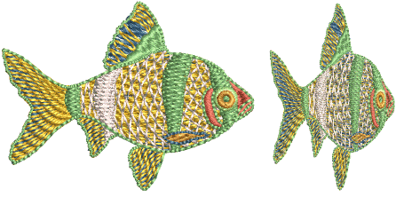

# Machine Files

By default EmbroideryStudio saves to its native file format, [EMB](../../glossary/glossary). This format contains all information necessary both for stitching a design and for later modification. When opening designs created or saved in other formats, EmbroideryStudio converts them internally to EMB format. They can then be modified using the full range of EmbroideryStudio features. Depending on the file type, you may need to provide additional information to assist EmbroideryStudio in the conversion process.

## Related topics...

- [Opening machine files](Opening_machine_files)
- [Reassigning colors to machine files](Reassigning_colors_to_machine_files)
- [Reading Melco CND design files](Reading_Melco_CND_design_files)
