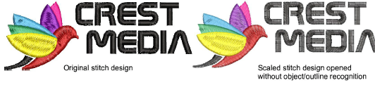

# Object recognition

Machine files are generally not suited to modification because stitches are not regenerated. However, EmbroideryStudio can interpret object outlines, stitch types and spacing from stitch data with some success. In this way, you can re-constitute old tape format files and other machine file formats for modification in EmbroideryStudio. These [‘recognized’](../../glossary/glossary) designs can be scaled with stitches recalculated for the new outlines. Processing is effective for most machine files but cannot produce the same level of quality as original outlines and may not handle some fancy stitches.

When you convert a machine file to [design file](../../glossary/glossary) format, EmbroideryStudio reads stitch data stitch-by-stitch according to the needle penetration points. It recognizes stitch types, spacing and length values, stitch effects, and can determine object outlines. Stitch types are assigned as Satin, Tatami, or Program Split depending on the pattern of needle penetrations.

With Tatami, EmbroideryStudio recognizes stitch spacing and length, and applies a random factor. If a design is converted from ESD format, Zigzag and Triple Run objects are also recognized. If an [object](../../glossary/glossary) is not recognized, it becomes (or remains) a [manual object](../../glossary/glossary) with general and connector properties only. As such, it will not scale well.

Recognized object outlines and stitch values are stored as object properties in EmbroideryStudio. This means you can scale and transform recognized designs in the usual way. You can also change the stitch density of the whole or selected parts of a design, and/or of certain stitch types.

By default, machine files are converted to outlines and [objects](../../glossary/glossary) upon opening but you can also choose to open them without [recognition](../../glossary/glossary). Designs opened in this way can be output for stitching in another format. Or you can edit stitches and add new elements. For such purposes, you do not need to retrieve information about how the design was created.

You can scale machine files which have been opened without object/outline recognition. However, because the stitch count does not change, the density increases or decreases with the design size. Thus you should not scale machine files by more than ±10% or some areas may be too thickly or too thinly covered.

Note: With or without object/outline [recognition](../../glossary/glossary), machine files can be saved in [EMB](../../glossary/glossary) format once they are opened in EmbroideryStudio.
