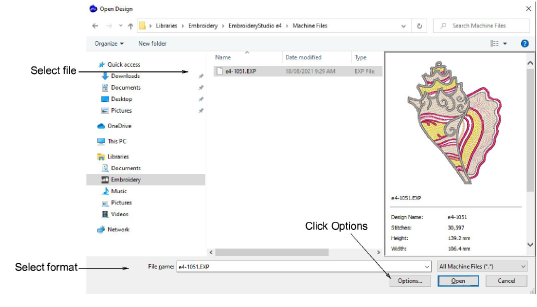
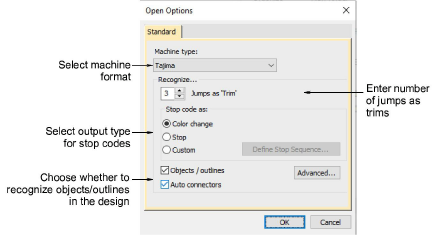
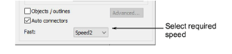
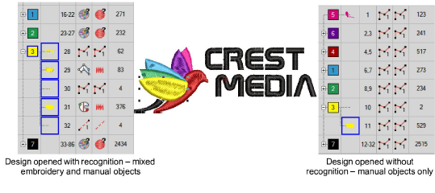

# Open machine files

When you open machine files with object/outline [recognition](../../glossary/glossary), you can set options to determine how the design will convert. Options vary with file type. Alternatively, by opening a machine file without recognition, stitch data is preserved. This allows you to perform minor stitch edits and scaling operations without compromising the original machine file. Alternatively, you can process the whole or selected parts of a design after opening and editing.

## To open machine files with or without object recognition...

1. Open a file from hard disk or read it from [embroidery disk](../../glossary/glossary).

2. Select a machine file format from the Files of type list and select the file to open.

3. Click Options. Depending on the file type selected, different options are available.

4. Select or deselect the Objects/Outlines checkbox.

Remember, when you open machine files without object/outline [recognition](../../glossary/glossary), ‘[manual objects](../../glossary/glossary)’ are created wherever machine functions – e.g. color changes or trims – are detected in the design. They have only general and connector [properties](../../glossary/glossary).

5. Select a different [machine format](../../glossary/glossary) from the Machine Type list as required.

The machine type will default to one suggested by the file format – e.g. DST will be interpreted as Tajima. However, you can choose to convert the file to a different machine format – e.g. Barudan.

6. Enter the number of jumps to recognize as trims.

When EmbroideryStudio encounters this number of consecutive jumps, it will convert them to a Trim function. If this value is different from the original design, Trim functions will be not be inserted correctly.

7. Use the Stop code as panel to select the output type for stop codes:

| Option       | Function                                                                                                                                                                                                                                               |
| ------------ | ------------------------------------------------------------------------------------------------------------------------------------------------------------------------------------------------------------------------------------------------------ |
| Color change | Stop codes are interpreted as ‘Next Color’ commands. The next color is selected from the default [color palette](../../glossary/glossary).                                                                                                             |
| Stops        | Stop codes are interpreted as ‘Explicit Stop’ commands. The machine stops stitching.                                                                                                                                                                   |
| Custom       | Lets you map thread colors to every stop code in the file. This means you can color code machine files which do not contain needle addressing information. [See Reassigning colors to machine files for details.](Reassigning_colors_to_machine_files) |

8. Toggle the Automatic Connectors checkbox as required.

| Option | Function                                                                                                                                                    |
| ------ | ----------------------------------------------------------------------------------------------------------------------------------------------------------- |
| On     | Open appropriate designs with automatic connectors without having to use object/outline recognition.                                                        |
| Off    | Open designs with connectors recognized as manual objects. This avoids stitch editing problems caused by automatic connectors – recommended for open fills. |

9. Check the status of your embroidery machine. Then select the correct setting – Speed1 or Speed2 – from the list (if available).

On some Barudan machines there is a speed switch. Depending on its position, fast is assigned as either Speed1 or Speed2. For example, if you select Speed1, each fast speed function will be translated into a Speed1 command.

10. Click Advanced to set advanced recognition options.

11. Click OK and then Open.

If you have ticked the Objects/Outlines checkbox, the design is processed and converted to embroidery objects with fill or outline stitch [properties](../../glossary/glossary) as well as general and connector properties. If an object is not recognized, it becomes a [manual object](../../glossary/glossary) with general and connector properties only.

If you have opened without recognition, you can output the design without change or perform minor scaling and transforming actions without losing the original stitch information. Alternatively, you can process the whole or selected parts of a design after editing.

## Related topics...

- [Machine Formats](../../Setup/machines/Machine_Formats)
- [Recognize object outlines](../../Modifying/functions/Recognize_object_outlines)
- [Adjusting stitch densities](../../Quality/quality/Adjusting_stitch_densities)
- [Using embroidery disks](../output/Using_embroidery_disks)
- [Gunold PCH format](../../Management/formats/Gunold_PCH_format)
- [Wilcom INP format](../../Management/formats/Wilcom_INP_format)
