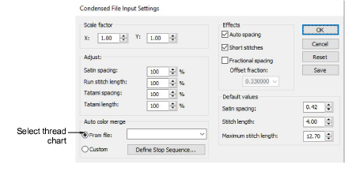
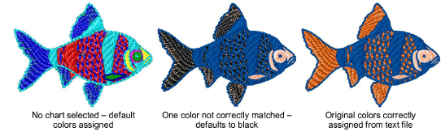

# Read CND files with color-merge TXT file

While CND files contain no thread color information themselves, the Auto color merge feature can read thread colors for CND files from an associated TXT file. Thus stitches are displayed in the correct colors when they are converted to [EMB](../../glossary/glossary). Auto color merge reads and interprets a TXT file containing colors from a named thread chart. You must specify the thread chart used when the design was originally created in EDS (or other design software).

## To read CND files with color-merge TXT file...

1. Select File > Open. The Open dialog opens.

2. Select a CND design and click Options. The Condensed File Input Settings dialog opens.

3. Select From file in the Auto color merge panel, and select a corresponding thread chart from the Auto color merge droplist.

Any thread color named in the text file must correspond to a color in the selected thread chart. If not, it will default to black.

4. Click OK. The design opens, the stitches appear in the correct thread colors, and the [color palette](../../glossary/glossary) displays the selected thread chart.

## Related topics...

- [Reassigning colors to machine files](Reassigning_colors_to_machine_files)
- [Create a color-merge TXT file](Create_a_color-merge_TXT_file)
