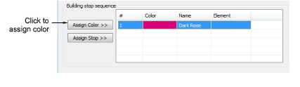

# Reassigning colors to machine files

When you open a machine file or CND file, a design without color code assignment automatically uses the default [color palette](../../glossary/glossary). You can, however, map thread colors to every Color Stop code in the file. This means that before opening the file you can color-code designs which do not contain [needle addressing](../../glossary/glossary) information.

Note: In order to assign colors correctly, you need to consult a [production worksheet](../../glossary/glossary) for the necessary color sequence information.

## To reassign colors to a machine file...

1. Select File > Open. The Open dialog opens.

2. Select a machine file or CND design and click Options.

If you’ve selected a machine file, the Open Options dialog opens. If CND, the Condensed File Input Settings dialog opens. This procedure is the same.

3. Select Custom and click Define stop sequence.

The Define Stop Sequence dialog opens. Initially the Building stop sequence panel is empty.

4. Select a thread chart and first color.

5. Click Assign Color. The color and the description are entered at the current Stop in the Building stop sequence grid.

Note: The selection moves to the next color in the thread chart. Two consecutive same colors are not allowed and Assign Color is disabled.

6. Click Assign Stop to enter an explicit Stop code.

Stop is entered in the Description field.

Note: A Stop Sequence Warning message displays if a redundant color function is assigned. Press Delete to delete a selected entry in the stop sequence. Click Reset to delete all the entries.

7. Use the Extra Stop codes as panel to select the output type for extra stop codes:

| Option          | Function                                                                                                                                                                                                                                                         |
| --------------- | ---------------------------------------------------------------------------------------------------------------------------------------------------------------------------------------------------------------------------------------------------------------- |
| Color changes   | [Extra Stop codes are interpreted as ‘Next Color’ commands. The next color is selected from the default color palette.](../../glossary/glossary)                                                                                                                 |
| Stops           | Extra Stop codes are interpreted as ‘Explicit Stop’ commands. The machine stops stitching.                                                                                                                                                                       |
| Repeat sequence | If you select fewer colors than the design requires, the selected colors are repeated. For example, if your design requires four colors and you’ve only selected two in the Building Stop Sequence list, colors 3 & 4 will be the same as original colors 1 & 2. |

8. Repeat the operation as many times as indicated in the production worksheet.

9. Click OK. The design will have the desired colors and the correct number of Color Changes.

Note: You can convert color changes to an explicit Stop Code. You can also remove Color Stops by assigning the same color number to consecutive color blocks.

## Related topics...

- [Read CND files with color-merge TXT file](Read_CND_files_with_color-merge_TXT_file)
