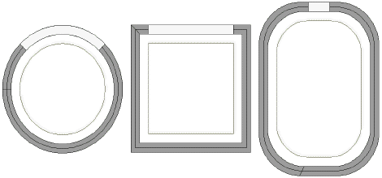

# Creating custom hoops

You may be working with hoops which don’t appear in the standard hoop list. Define your own hoops using circle, oval, rectangle, and other shapes.

## Related topics...

- [Custom hoop types](Custom_hoop_types)
- [Define custom hoops](Define_custom_hoops)
